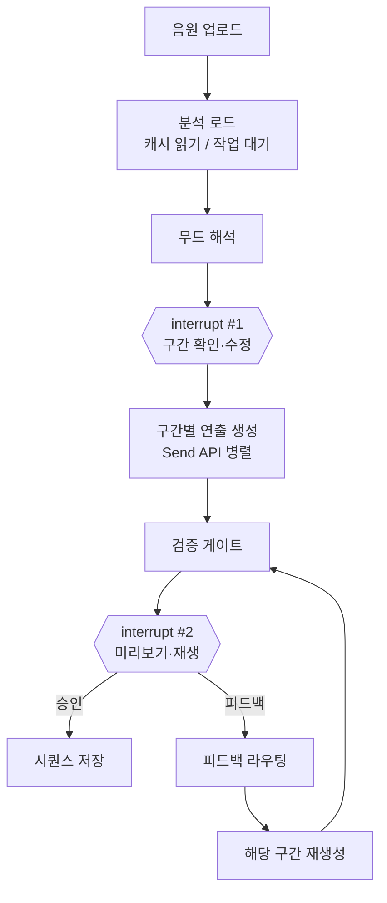
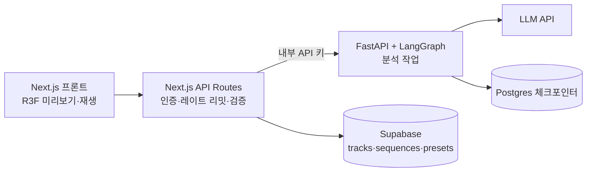

# 무대 연출 디렉터 에이전트 기획서

2026-09-18 · @Someone

## 1. 개요

아티스트 음원을 에이전트가 분석해 구간별 무대 연출(조명·색상·스모그·카메라)을 제안하고, 스태프가 두 번 확인해 다듬은 뒤 시퀀스로 저장한다.

| 항목 | 내용 |
| --- | --- |
| 프로젝트명 | 무대 연출 디렉터 에이전트 (가칭) |
| 대상 | STAGE.ONE B탭 `/staff/stage` (무대 연출 3D 툴) |
| 목적 | 음원 분석 → 구간별 `StageState` 제안 → 스태프 피드백으로 부분 재생성 → 시퀀스 저장 및 재생 |
| 음원 | 사람이 Lyria(Gemini)로 생성해 에셋으로 등록. 에이전트는 생성하지 않고 분석만 한다 |
| 프레임워크 | LangGraph (Python) |
| 아키텍처 | Next.js(프론트·API) + 별도 Python FastAPI 서비스(LangGraph · 음원 분석) |
| 포지셔닝 | 자율 에이전트가 아닌, 사람이 개입하는 에이전트 워크플로우(human-in-the-loop agentic workflow) |

## 2. 배경 및 문제 정의

2차 고도화로 무대 툴의 파라미터가 크게 늘어, 곡마다 처음부터 조합을 잡는 비용이 커졌다.

- 현재 스태프는 스팟 3개(Left/Center/Right) 각각의 on/off·밝기·조명각, 자유 조명 색상, 스모그 농도·색상, 카메라 앵글을 모두 수동으로 조작한다.
- 이름 붙여 저장하는 프리셋(`stage_presets`, 소유 스코프 RLS)은 있지만, 프리셋은 정지된 상태 하나라 곡의 흐름(인트로→코러스→아웃트로)을 담지 못한다.
- 곡의 구간 구조와 에너지 변화는 음원 안에 이미 있다. 이걸 분석해 초안을 만들면 스태프는 "처음부터 만들기" 대신 "고치기"만 하면 된다.

## 3. 핵심 가치

코드가 측정하고, LLM이 해석하고, 사람이 확정한다.

- **근거 있는 판단**: 음원의 에너지·템포·구간을 수치로 측정하고, LLM은 그 수치를 근거로 연출을 정한다. "코러스 에너지가 평균의 1.8배라 밝기 800"처럼 설명 가능한 출력이 나온다.
- **기존 구조 재사용**: 출력은 기존 `StageState` 타입, 검증은 기존 `mergeStageState`, 싱글 저장은 기존 프리셋 API를 그대로 쓴다.
- **시각적 피드백 루프**: 제안이 R3F 씨에 즉시 반영되고, 음원 재생과 싱크돼 구간이 바뀔 때 조명이 바뀐다.
- **부분 재생성**: "코러스만 다시"라고 하면 나머지 구간은 유지하고 해당 구간만 다시 만든다. 이 "생성 → 피드백 → 부분 재생성" 패턴은 다른 도메인에도 재사용할 수 있다.

## 4. 입력 설계

입력의 중심은 음원 파일이고, 구간 분해는 에이전트가 한다. 사람은 이후 경계를 검토·수정만 한다.

| 입력 | 출처 | 설명 |
| --- | --- | --- |
| 음원 파일 | 사람이 Lyria로 생성 후 업로드 | 최대 3분, Supabase Storage 저장(서명 URL) |
| 곡 메타 | 스태프 입력 | 제목, 장르, 전체 무드 키워드(선택) |
| 아티스트 컨셉 | 기존 DB | 시그니처 컬러, 셰이더 테마, 기존 프리셋 목록 → 일관성 근거 |
| 구간 수정 | 스태프(interrupt #1) | 자동 분석된 구간 경계·라벨 교정 |
| 연출 피드백 | 스태프(interrupt #2) | 자연어 피드백 (예: "코러스가 인트로랑 너무 비슷해") |

음원 이용 조건: Gemini 생성 트랙은 SynthID 워터마크가 포함되고 생성형 AI 사용 정책이 적용된다. 화면에는 갤러리와 같이 "AI로 생성됨"을 표기한다.

- [ ] MIT 공개 저장소에 음원 파일을 올려도 되는지 약관 확인 (애매하면 Storage에만 보관)

## 5. 음원 분석 설계

분석은 3층으로 나눈다. 시간과 수치는 코드가 책임지고, LLM은 해석만 한다.

| 층 | 담당 | 산출물 | 비고 |
| --- | --- | --- | --- |
| 수치 측정 | librosa | BPM, 비트 위치, RMS 에너지 곡선, 온셋 밀도 | 결정론적, 테스트 용이 |
| 구간 구조 | 음악 구조 분석 모델 (예: all-in-one) | 구간 경계(초), 라벨(인트로/벌스/코러스 등) | 무겁고(PyTorch), AI 생성곡 정확도 미검증 |
| 무드 해석 | 오디오 입력 가능한 멀티모달 LLM | 구간별 무드 서술 | 앞 두 층 결과를 근거로 받음 |

실행 원칙

- 분석은 곡당 한 번만. 결과는 `tracks.analysis`(jsonb)에 저장하고 파일 해시로 캐싱한다.
- 시드 곡은 오프라인 스크립트로 미리 분석한다. 분석 서비스가 느리거나 죽어도 데모 전체 흐름이 동작한다.
- 새 곡 업로드 시에는 같은 파이프라인이 백그라운드 작업으로 돌고, 프론트는 진행 상태를 표시한다.
- 분석 파이프라인은 LangGraph 밖의 일반 Python 함수로 둔다. 그래프의 분석 노드는 캐시를 읽거나 작업을 시작시키는 역할만 한다.
- 분석 결과 jsonb에도 `mergeStageState`처럼 필드별로 방어하는 파서를 둔다.

## 6. 출력 스키마

새 스키마를 만들지 않는다. 구간별 출력은 기존 `StageState`이고, 시퀀스는 그 배열에 시간 정보를 더한 것이다.

| 필드 | 범위 / 값 | 에이전트 사용 |
| --- | --- | --- |
| `color` | hex (씨 전체 공통 1개) | 사용. 기본은 아티스트 시그니처 컬러, 벗어나면 이유 기록 |
| `spots.<left/center/right>.on` | boolean | 사용 |
| `spots.*.intensity` | 0–1000 | 사용 (에너지 곡선과 연동) |
| `spots.*.angle` | 0.1–1.0 | 사용 |
| `spots.*.penumbra` | 0–1 | **제외**. 빛줄기에 반영되지 않아 UI에서도 제거된 필드 |
| `camera` | `front` / `audience` / `top` | 사용 (enum 외 값은 병합 시 기본값) |
| `smoke.density` | 0–1 | 사용 |
| `smoke.color` | hex | 사용 |

시퀀스 항목 (구간당 1개)

```json
{
  "sectionLabel": "chorus",
  "startSec": 42.3,
  "endSec": 71.8,
  "transitionMs": 2000,
  "state": { "...": "StageState" },
  "rationale": "코러스 에너지가 곡 평균의 1.8배라 세 스팟 모두 켜고 밝기 800"
}
```

검증 규칙

- LLM 출력은 반드시 `mergeStageState`를 통과시킨다. 빠진 필드와 enum 외 값은 기본값으로 떨어진다.
- 숫자 범위 clamp를 `mergeStageState`가 하는지 확인하고, 없으면 추가해 TDD로 테스트한다.
- Python 측에도 같은 규칙의 pydantic 모델을 둔다. 최종 방어선은 Next.js의 `mergeStageState`다.

## 7. 워크플로우 (LangGraph)

그래프는 분석 → 구간 확인 → 연출 생성 → 승인의 흐름이고, 사람 확인(interrupt)이 두 번 들어간다.



노드별 핵심

- **분석 로드**: 캐시된 분석 결과가 있으면 읽고, 없으면 백그라운드 작업을 시작시킨다. 무거운 분석을 그래프 안에서 동기로 돌리지 않는다.
- **interrupt #1 구간 확인**: 자동 구간 검출은 완벽할 수 없으므로, 연출을 만들기 전에 스태프가 경계를 먼저 바로잡는다.
- **구간별 연출 생성**: Send API로 구간마다 분기하고, Reducer로 결과를 상태에 합친다. 앞뒤 구간을 컨텍스트로 넘겨 전환을 자연스럽게 한다.
- **피드백 라우팅**: 피드백이 어느 구간에 영향을 주는지 LLM이 판단한다("전체적으로 너무 밝아" → 전 구간). Command로 상태 갱신과 다음 노드 지정을 한 번에 한다. 이 기획에서 가장 에이전트다운 판단 지점이다.
- **버전 되돌리기(확장)**: Time Travel로 "코러스 이전 버전"으로 돌아갈 수 있다.

## 8. 시스템 연동 및 데이터 모델

싱글 프리셋은 기존 API를 그대로 쓰고, 시퀀스부터는 테이블 두 개가 새로 필요하다. "백엔드 수정 없음"은 1단계에만 해당한다.

| 대상 | 상태 | 내용 |
| --- | --- | --- |
| `stage_presets` + `/api/stage-presets` | 기존 | 싱글 `StageState` 저장 (1단계) |
| `tracks` | 신규 | 아티스트, 스토리지 경로, 파일 해시, `analysis` jsonb(BPM·비트·구간·에너지·무드), 분석 상태 |
| `stage_sequences` | 신규 | 트랙 + 구간별 시퀀스 항목 배열, 소유 스코프 RLS(기존 프리셋과 동일 원칙) |
| 아티스트·기존 프리셋 | 기존(읽기) | 시그니처 컬러·테마를 연출 근거로 제공 |

재생 싱크 (프론트)

- 재생 중 현재 구간은 `useFrame`에서 `audio.currentTime`을 읽어 결정한다.
- 구간 사이 보간(`transitionMs`)은 React state가 아닌 ref로 R3F 트리 안에서 처리하고, 구간 경계에서만 state를 커밋한다. 초당 60번 state를 바꾸면 v2.2에서 100ms 스로틀로 막은 Canvas 재구성 문제가 재현된다.
- 재생은 브라우저 자동재생 정책때문에 반드시 사용자 클릭으로 시작한다.
- interrupt #1 UI는 에너지 곡선 위에 구간 마커를 그리고 드래그로 경계를 조정하는 방식으로 만든다.

## 9. 아키텍처

별도 Python 서비스로 분리한다. 무거운 오디오 모델과 백그라운드 작업은 Vercel 서버리스에서 돌릴 수 없기 때문이다.



분리 근거

- 음원 구조 분석 모델(PyTorch)과 librosa는 Python 생태계에 있고, 곡당 수십 초 이상의 백그라운드 작업이 필요하다.
- LangGraph와 노마드코더 AI Agents 마스터클래스를 Python으로 학습하며 구현한다. 학습·역량 시연 목적의 의도적 분리임을 문서에 명시한다.
- README "백엔드 서버 분리 없음" 항목은 이 근거와 함께 갱신한다.

경계 규칙

- Python 서비스는 LLM 호출과 분석만 한다. Supabase 쓰기는 Next.js가 하고, service role 키는 어느 쪽에도 두지 않는다(기존 원칙 유지).
- interrupt를 웹에서 쓰려면 "생성 요청"과 "피드백 제출"이 다른 HTTP 요청이므로, `thread_id`를 시퀀스 작업 단위와 연결하고 Postgres 체크포인터에 상태를 저장한다.
- 호스팅은 콜드 스타트가 없는 플랜을 우선 검토한다. 잠드는 무료 티어는 데모 순간 수십 초 지연을 만든다.

## 10. MVP 단계

가장 불확실한 "AI 생성곡 분석 정확도"를 맨 앞에서 검증하고, 각 단계가 끝날 때마다 데모 가능한 상태를 유지한다.

| 단계 | 범위 | 완료 기준 |
| --- | --- | --- |
| 1. 분석 스파이크 | Lyria 곡 1\~2개를 로컬 스크립트로 분석, JSON 육안 검토 | 구간 경계가 쓸 만한지 판단. 부정확하면 "에너지 곡선 기반 경계 제안 + 수정"으로 전환 |
| 2. 싱글 제안 | 구간 하나의 분석 → `StageState` 1개 생성 → 기존 프리셋 API로 저장 | 백엔드 수정 없이 씨에 반영·저장됨 |
| 3. 시퀀스 + 재생 | 전체 구간 생성, `tracks`·`stage_sequences`, ref 기반 재생 싱크 | 음원 재생에 맞춰 구간별 조명 전환, `webglcontextlost` 0건 |
| 4. 사람 개입 | interrupt #1(구간 수정), #2(피드백 라우팅·부분 재생성), 체크포인터 | 다른 요청에서 그래프 재개, 대상 구간 외 불변 |
| 5. 실시간 분석 + 배포 | 업로드 시 백그라운드 분석, 진행 상태 UI, Python 서비스 배포 | 배포 환경에서 업로드부터 저장까지 동작 |

확장(범위 밖): 아티스트 셰이더(파동/동심원/알갱이) 파라미터에 같은 패턴 재사용, Time Travel 기반 버전 되돌리기.

## 11. 리스크 및 대응

| 리스크 | 대응 |
| --- | --- |
| AI 생성곡에서 구간 분석 정확도가 낮음 | 1단계 스파이크로 먼저 검증, interrupt #1에서 스태프가 경계 수정 |
| 시퀀스 재생이 WebGL 컨텍스트 상실을 재현 | 보간은 ref + `useFrame`, state는 구간 경계에서만 커밋 |
| LLM 연출이 감각적이지 않음 | 아티스트 컨셉·기존 프리셋을 근거로 제공, 소규모 평가 세트와 규칙 체크(예: 에너지와 밝기가 같은 방향, 잔잔한 구간 밝기 ≤ 500) |
| 부분 재생성이 앞뒤 구간과 어색함 | 인접 구간을 컨텍스트로 전달 |
| 공유 데모 계정으로 누구나 호출 가능 → 비용 | Next.js에서 계정·IP 기준 레이트 리밋, 일일 호출 한도, 한도 초과 시 캐시된 예시 시퀀스로 폴백 |
| Python 서비스 배포·콜드 스타트 | MVP는 로컬에서 두 서비스 함께 개발, 시드 곡은 사전 분석으로 분석 서비스 없이도 데모 가능 |
| Next.js ↔ Python 간 통신 보안 | 내부 API 키 인증, Python 서비스는 Supabase에 직접 쓰지 않음 |
| 음원 약관·재배포 | "AI로 생성됨" 표기, 공개 저장소 포함 여부는 약관 확인 후 결정 |

## 12. 선수강 목록 (AI Agents 마스터클래스)

필수 6개 챕터(약 6시간)를 듣고 시작하며, 선택 챕터는 표의 시점까지만 들으면 된다.

### 필수 (구현 시작 전)

| 챕터 | 분량 | 이 기획에서 쓰이는 곳 |
| --- | --- | --- |
| #0 Introduction | 약 19분 | 강의 구조와 Breaking Changes(0.6) 파악 |
| #1 Environment Setup | 약 20분 | uv·pyproject 기반 환경. 건너뛰면 이후 코드가 환경 차이로 막힘 |
| #2 Your First AI Agent | 약 1시간 | 프레임워크 없는 도구 호출·메모리. 분석 함수 도구화의 기본 |
| #13 Introducing LangGraph | 약 1시간 45분 | Graph State, Reducer(구간 합치기), Node Caching(분석 캐시), Conditional Edges, Send API(구간 병렬), Command(피드백 라우팅) |
| #14 LangGraph Agents (전체) | 약 1시간 25분 | Tool Nodes, Memory(체크포인터), Human-in-the-loop(interrupt 2회), Time Travel(버전 되돌리기), DevTools(디버깅) |
| #15 유튜브 썸네일 크리에이터 (전체) | 약 1시간 15분 + 15.0 | 오디오 추출(15.1), Human Feedback(15.4). "분석 → 시안 → 피드백 → 최종본"의 1:1 레퍼런스 |

### 선택 (시점까지 수강)

| 챕터 | 분량 | 들어야 할 시점 | 이유 |
| --- | --- | --- | --- |
| #16 Workflow Architectures | 약 1시간 10분 | 4단계(사람 개입) 전 | Routing(피드백 라우팅), Parallelization(구간 생성), Prompt Chaining Gate(검증 게이트) |
| #17 Testing Agents | 약 45분 | 5단계(배포) 전 | LLM 노드 테스트. 결정론적 로직(검증·파서) 테스트는 강의와 무관하게 처음부터 작성 |
| #21 Deploying Agents | 약 40분 | 5단계(배포) 전 | FastAPI 스트리밍·배포. 21.0으로 어떤 프레임워크 기준인지 먼저 확인 |
| #20.4 FastAPI Server | 약 17분 | FastAPI가 처음이면 3단계 전 | A2A 본문은 불필요, FastAPI 부분만 참고 |

### 강의 밖에서 채울 것

- librosa 기초(BPM, RMS 에너지, 온셋), 음악 구조 분석 모델 사용법 — 1단계 스파이크에서 필요
- LangGraph Postgres 체크포인터 연결과 `thread_id` 설계 — 4단계에서 필요

### 들을 필요 없는 챕터

\#3\~#12(CrewAI·AutoGen·OpenAI Agents SDK·ADK), #18 멀티 에이전트 아키텍처, #19 튜터, #20 A2A(20.4 제외), #22 Claude Agent SDK. 단, #7·#8·#9는 투어 가이드 에이전트에서 듣는다.
