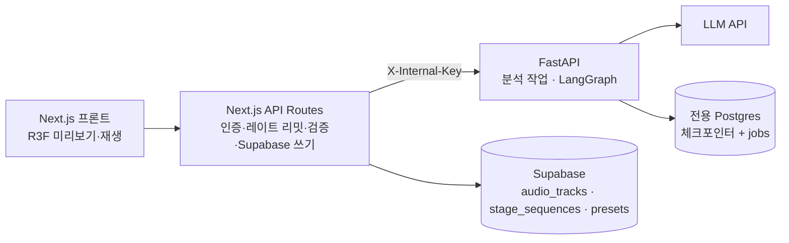

# 무대 연출 디렉터 에이전트 — 설계 스펙

2026-09-19 · 기반 문서: [기획서](../../stage-director-agent-proposal.md)

이 문서는 기획서를 브레인스토밍으로 검토한 결과다. 기획서의 방향(음원 분석 → 구간별 `StageState` 제안 → 사람 확인 2회 → 시퀀스 저장)은 유지하고, 기획서가 열어둔 결정과 기존 on-stage 코드와 어긋난 부분을 확정한다.

- 범위: Python 서비스(LangGraph·분석) 설계, Supabase 신규 테이블 요구사항, Next.js ↔ Python 프로토콜, `contracts/` 추출 요건
- 범위 밖: R3F 재생 싱크 UI, interrupt #1 마커 UI 상세 (프론트 설계는 별도), Time Travel, 셰이더 파라미터 확장
- 이 저장소는 `../on-stage`를 읽기 전용으로만 참고한다. on-stage 수정이 필요한 항목은 §11에 별도 작업으로 분리했다.

## 1. 확정한 결정

| # | 결정 | 선택 | 이유 |
| --- | --- | --- | --- |
| D1 | 승인 전 초안 위치 | 작업 시작 시 `stage_sequences` 행 생성(`status=draft`, `thread_id`=행 id). 초안 내용은 체크포인터에만 있고, 승인 시 `items`를 채움 | 진실 공급원이 하나(초안=체크포인터, 승인본=행). `thread_id` 소유권·"진행 중" 목록·레이트 리밋 카운트가 행 하나로 해결됨 |
| D2 | 체크포인터 DB | 전용 Postgres 분리(로컬 docker compose, 배포 시 소형 관리형 Postgres) | `PostgresSaver`는 DB 직접 연결이 필요해 Supabase에 두면 "Python은 Supabase 자격증명을 갖지 않는다"는 원칙이 깨짐. 체크포인트는 버려도 되는 임시 데이터 |
| D3 | 승인본 보관 | 승인본 누적, 최신 `approved_at`이 현재. 곡당 승인본 5개 상한 | Time Travel 없이도 이전 안 복귀 가능. 공유 데모 계정의 행 증가를 상한으로 제어 |
| D4 | 실행 방식 | 비동기 작업 + 폴링 (`running / waiting_input / done / error`) | Vercel 실행 시간 제한 회피, 업로드 분석 진행 UI와 패턴 공유, 탭을 닫았다 돌아와도 이어서 봄 |
| D5 | 분석 로드 노드 | 그래프 밖으로 이동. 분석은 별도 작업, 그래프는 분석 완료된 곡에서만 시작 | Python은 Supabase를 읽을 수 없어 캐시 조회는 Next.js 몫이라 노드가 할 일이 없어짐 |
| D6 | 시퀀스 항목 저장 | `stage_sequences.items` jsonb 배열 (자식 테이블 없음) | 구간 10개 안팎, 재생 시 통째로 읽음 |
| D7 | 새 음원 테이블 이름 | `audio_tracks` (기획서의 `tracks`는 기존 디스코그래피 테이블과 충돌) | 기존 `tracks`는 오너 전용 쓰기 RLS라 공유 데모 계정이 업로드할 수 없음 |

## 2. on-stage 조사 결과

기획서를 쓸 때 가정과 실제가 다른 곳이다. 근거 파일은 모두 `../on-stage/` 기준.

| 사실 | 근거 | 영향 |
| --- | --- | --- |
| `mergeStageState`는 숫자를 `typeof === "number"`로만 검사한다. **범위 clamp 없음, hex 형식 검증 없음, NaN/Infinity 통과** | `src/lib/stageState.ts` | 기획서 §6의 "최종 방어선은 `mergeStageState`"는 현재 성립하지 않음. §7의 대응 참고 |
| `POST /api/stage-presets`는 `state`를 검증 없이 jsonb로 저장한다 | `src/app/api/stage-presets/route.ts` | 에이전트 출력은 저장 전에 반드시 자체 검증을 거쳐야 함 |
| `tracks` 테이블이 이미 있다(no, title, duration, cover). 쓰기는 오너 전용 | `supabase/migrations/20260813120014_init.sql` | D7 |
| Storage 버킷 `gallery`는 이미지 3종, 10MB만 허용 | 같은 파일 | 음원 버킷 신설 필요 |
| 인증은 쿠키 세션 + RLS (`createServerSupabase`, `auth.getUser()`) | `src/lib/supabase/server`, `src/proxy.ts` | Python은 사용자 신원이 없음 → `thread_id` 소유 검증은 Next.js가 함 |
| `penumbra`는 `SpotState` 타입, 기본값(0.6), `StageScene`의 SpotLight에는 남아 있고 UI 슬라이더만 제거됨 | `StageScene.tsx`, `SpotControls.tsx` | pydantic 모델에 유지(기본 0.6), 에이전트는 값을 바꾸지 않음. 왕복 시 값이 사라지면 안 됨 |
| 프리셋 API는 GET/POST/DELETE만 있고 PATCH 없음. 덮어쓰기는 POST `overwrite: true`(upsert) | `stage-presets/route.ts`, `[id]/route.ts` | 계약 파일에 그대로 반영 |
| 슬라이더 범위는 UI 상수뿐(design-v2 §5.3): intensity 0–1000, angle 0.1–1.0, penumbra 0–1, smoke.density 0–1 | `docs/design-v2.md` | Python 모델의 clamp 기준 |
| 슬라이더 조작은 100ms 스로틀 없이는 `webglcontextlost`가 재현됨 | `hooks.ts`의 `useThrottledChange` | 재생 중 state 커밋은 구간 경계에서만 (기획서 §8 유지) |

## 3. 아키텍처와 경계



| 주체 | 책임 | 하지 않는 것 |
| --- | --- | --- |
| Next.js | 쿠키 세션 인증, RLS, 레이트 리밋, Supabase 읽기·쓰기, 음원 업로드(서명 URL), Python 중계, 최종 저장 전 검증 | LLM 호출, 오디오 분석 |
| Python (FastAPI) | librosa 분석, LangGraph 실행, LLM 호출, 체크포인터·jobs 소유 | Supabase 접근. 필요한 컨텍스트는 전부 요청 본문으로 받는다 |
| 전용 Postgres | LangGraph 체크포인터 테이블, `jobs` 테이블 | Python 외 접근 |

Python이 요청으로 받는 컨텍스트: 분석 JSON, 곡 메타(제목·장르·무드 키워드), 아티스트 컨셉(slug, color, shader 파라미터), 기존 프리셋 목록, 음원 서명 URL. Python은 이것을 그래프 상태에 **스냅샷**으로 저장해 "LLM이 실제로 본 입력"을 재현 가능하게 한다.

## 4. 실행 프로토콜

### 4.1 분석 작업 (그래프 밖)

1. 업로드 후 Next.js가 `audio_tracks` 행 생성(`analysis_status=pending`). `file_hash`가 같은 본인 곡에 분석 결과가 있으면 재사용하고 끝.
2. Next.js → Python `POST /analyze {jobId, audioUrl}` → 202.
3. 프론트가 `GET /api/audio-tracks/{id}`를 폴링. Next.js가 Python `GET /analyze/{jobId}`를 조회해 `running / done / error`와 진행률을 전달한다.
4. `done`이면 Next.js가 `analysis`를 저장(멱등)하고 `analysis_status=done`. 탭을 닫아도 결과는 Python `jobs`에 7일 보관되어 다음 폴링 때 저장된다.
5. 시드 곡은 오프라인 스크립트로 미리 분석해 이 경로를 건너뛴다. 분석은 이미 `audio_tracks.analysis`에 있으므로 무거운 분석 작업(librosa·구조 모델)은 돌지 않고, 그래프는 Next.js가 채워주는 컨텍스트만으로 시작한다.

### 4.2 시퀀스 생성 작업

| 요청 | 동작 |
| --- | --- |
| `POST /api/sequences {audioTrackId}` | 아래 순서로 검사한다. ① 인증 ② 레이트 리밋 ③ 곡 조회(RLS, 보이지 않으면 404) ④ **곡의 `analysis_status`가 `'done'`이 아니면 409 `{error:"analysis_not_ready"}`로 거절**(`pending`·`running`·`error` 모두 해당. 그래프는 분석 완료된 곡에서만 시작한다는 D5의 진입 조건) ⑤ 곡당 승인본 5개 상한(초과 시 409). 모두 통과하고 이미 `draft`가 있으면 새로 만들지 않고 그 행을 반환하되, **반환하기 전에 Python `GET /runs/{threadId}`로 스레드가 살아 있는지 확인한다.** 스레드가 없으면(§6.4 규칙 2로 삭제됨) 초안 행을 반환하지 않고 `GET /api/sequences/{id}`와 같은 410 정리 경로를 탄다(초안 행 삭제 후 410). 클라이언트가 다시 요청하면 `draft`가 없으므로 새로 만든다. `draft`가 없으면 행 생성 후 Python `POST /runs {threadId, context}` → 202. Python 호출이 실패하면 행을 삭제(보상)하고 502 |
| `GET /api/sequences/{id}` | 행 조회(RLS)로 소유권 확인 후 Python `GET /runs/{threadId}` 결과를 합쳐 `{status, interrupt?, error?}` 반환. Python이 스레드를 모르면(만료) 행을 삭제하고 410 |
| `POST /api/sequences/{id}/resume` | 본문 `{interruptId, kind: "sections"|"feedback"|"approve", payload}`. Python은 `waiting_input`이면서 `interruptId`가 현재 것과 같을 때만 받는다. 아니면 409 (더블 클릭·낡은 화면 방어) |
| 승인 완료 | Python `done` 응답의 최종 시퀀스를 Next.js가 §7 검증 후 `items` 저장, `status=approved`, `approved_at=now()` |

Python 엔드포인트는 모두 `X-Internal-Key` 필수이며 키는 서버 환경변수에만 둔다. `POST /runs`는 같은 `threadId`로 다시 호출되면 멱등하다(이미 있으면 현재 상태 반환, 마지막 체크포인트에서 재개 필요 시에만 재실행).

## 5. 데이터 모델 (Supabase 신규)

DDL은 on-stage 마이그레이션에 들어간다(§11). 이 저장소는 계약 파일에 요구사항으로만 기록한다.

**`audio_tracks`**

| 컬럼 | 비고 |
| --- | --- |
| id uuid pk | |
| user_id uuid null | NULL = 시드 곡. 기본값 `auth.uid()` |
| artist_id uuid fk | |
| title, genre text, mood_keywords text[] | 곡 메타 |
| storage_path text | 음원 버킷 경로 |
| file_hash text | sha256. 분석 캐시 키 |
| duration_sec numeric | 최대 180 |
| analysis jsonb null, analysis_status text | `pending / running / done / error` |
| created_at | |

RLS: 읽기 `user_id is null or user_id = auth.uid()`(시드 공개, `gallery_images`의 시드 패턴과 동일), 쓰기 `user_id = auth.uid()`.

**`stage_sequences`**

| 컬럼 | 비고 |
| --- | --- |
| id uuid pk | = LangGraph `thread_id` |
| user_id uuid, audio_track_id uuid fk | |
| status text | `draft / approved` |
| items jsonb null | 승인 전 null |
| approved_at timestamptz null, created_at | |

- RLS: `stage_presets`와 동일한 완전 사용자 스코프(`user_id = auth.uid()`).
- 부분 유니크 인덱스: `(user_id, audio_track_id) where status = 'draft'`.
- 승인본 5개 상한은 `(user_id, audio_track_id)` 단위이며 Next.js 라우트에서 강제한다. §1 D3, §4.2의 "곡당"도 같은 뜻이다.

**`items` 항목** (기획서 §6 그대로)

```json
{ "sectionLabel": "chorus", "startSec": 42.3, "endSec": 71.8,
  "transitionMs": 2000, "state": { "...": "StageState" }, "rationale": "..." }
```

불변식(검증 게이트와 Next.js 저장 직전에 동일하게 검사):
- 배열 순서 = 시간 순서, `startSec < endSec`
- 첫 항목 `startSec = 0`, 마지막 `endSec = duration_sec`, `items[i].endSec == items[i+1].startSec` (빈틈·겹침 없음 → 재생 시 `currentTime`으로 구간 조회가 단순해짐)
- `0 <= transitionMs <= (endSec - startSec) * 1000`

**음원 Storage 버킷** 신설: audio MIME 허용 목록과 3분 곡 기준 크기 상한. 업로드는 `/api/gallery/upload-url`의 서명 URL 패턴을 복제한다.

## 6. 체크포인터와 그래프 상태

### 6.1 전용 Postgres 스키마

| 테이블 | 소유 | 내용 |
| --- | --- | --- |
| `checkpoints`, `checkpoint_blobs`, `checkpoint_writes`, `checkpoint_migrations` | LangGraph | `setup()`이 생성. 스키마를 직접 설계하지 않는다 |
| **`jobs`** | 이 프로젝트 | `id text pk`(`thread_id` 또는 `jobId`), `kind`(`analysis`/`graph`), `status`(`running/waiting_input/done/error`), `progress real null`, `result jsonb null`, `error text null`, `created_at`, `updated_at` |

`jobs`가 필요한 이유: 백그라운드 실행 중 Python 프로세스가 죽으면 체크포인트만으로는 "실행 중이었는지"를 알 수 없다. 서비스 시작 시 `status=running`인 행을 `error(interrupted)`로 바꾸고, 사용자가 "다시 시도"하면 같은 `thread_id`로 마지막 체크포인트에서 재개한다.

상태 판정(그래프 작업): 체크포인트의 `next`가 비고 `jobs.status=done`이면 완료, `tasks`에 interrupt가 있으면 `waiting_input`, 그 외 `jobs.status`를 그대로 신뢰한다.

### 6.2 `thread_id`

`thread_id = stage_sequences.id`(uuid 문자열). Python은 이 값의 소유자를 검증하지 않는다. 모든 Python 호출은 Next.js가 RLS로 소유권을 확인한 뒤에만 나가며, 내부 API 키는 서버 사이드에만 존재한다.

### 6.3 그래프 상태

체크포인트가 커지지 않도록 곡선은 다운샘플해 스냅샷한다(전체 20KB 미만 목표).

| 필드 | 내용 | 리듀서 |
| --- | --- | --- |
| `context` | 곡 메타, 아티스트 컨셉, 기존 프리셋, 분석 스냅샷(BPM, 비트 위치, 에너지 곡선 ≤1점/초, 온셋 밀도, 구간 후보) | 시작 시 1회 설정 후 불변 |
| `sections` | `[{idx, label, startSec, endSec, mood}]`. 무드 해석 → interrupt #1에서 사용자 수정 반영 | 교체 |
| `proposals` | `{idx: SequenceItem}` | idx 단위 병합 리듀서(Send 병렬 합치기 + 부분 재생성) |
| `feedback_log` | `[{turn, text, targets: [idx]}]` | 추가 |
| `issues` | 검증 게이트가 낸 경고 | 교체 |
| `revision` | 정수. interrupt id 생성에 쓰임 | 증가 |
| `final` | 확정된 `items` | 1회 설정 |

- 구간 경계는 interrupt #1에서만 바뀐다. 이후 피드백은 기존 구간의 `state`·`rationale`만 재생성하므로 `idx`가 안정적이다.
- `interruptId = f"{thread_id}:{revision}:{kind}"`. 낡은 화면에서 온 resume은 거부된다.
- 부분 재생성 불변식: 피드백 라우팅이 지정한 `targets` 밖의 `proposals[idx]`는 바이트 단위로 같아야 한다(테스트 대상).
- Interrupt 페이로드: #1 `{kind:"confirm_sections", sections, energyCurve, durationSec}`, #2 `{kind:"review", items, issues}`. Resume 페이로드: #1 `{sections}`(연속 덮음·최소 길이 검증 후 수용), #2 `{action:"approve"}` 또는 `{action:"feedback", text}`.

### 6.4 보존 정책

아래 두 규칙은 **대상과 기준 시각, 지우는 범위가 서로 다르다.** 둘 다 서비스 시작 시와 주기 스크립트에서 실행한다.

**규칙 1. 승인된 스레드: 승인 24시간 후 체크포인트만 삭제**

- 대상: 승인이 끝난 그래프 작업(`jobs.kind=graph`, `jobs.status=done`).
- 기준 시각: `jobs.status`가 `done`이 된 시각(= 사용자가 승인해 최종 시퀀스가 나온 시점). Python은 Supabase의 `approved_at`을 볼 수 없으므로 이 시각을 쓴다.
- 삭제 범위: LangGraph 체크포인트(실행 기록)만 `adelete_thread`로 지운다. 승인본은 이미 `stage_sequences.items`에 있고 이후 조회는 그 행을 읽으므로 체크포인트는 필요 없다.
- 24시간을 두는 이유: 승인 직후 Next.js가 최종 시퀀스를 저장하다 실패해도 같은 스레드에서 결과를 다시 받아 저장할 수 있게 하는 여유 시간이다.

**규칙 2. 승인되지 않은 초안(draft): 7일 방치되면 통째로 삭제**

- 대상: 승인되지 않은 그래프 작업(`jobs.status`가 `running / waiting_input / error`).
- 기준 시각: `jobs.updated_at`(마지막 활동). 재개나 피드백이 있으면 갱신되므로 7일간 아무 활동이 없을 때만 해당한다.
- 삭제 범위: Python 쪽은 체크포인트와 `jobs` 행을 모두 지운다. Supabase의 `draft` 행은 Python이 지우지 못하므로(Supabase에 쓰지 않는다), 다음 조회 때 Next.js가 지운다. 스레드가 삭제된 초안을 조회하면 Python이 스레드를 모른다고 답하고, Next.js가 410을 돌려주며 초안 행을 삭제한다. UI는 "세션이 만료되었습니다. 다시 시작하세요"를 표시한다.

**참고: 분석 작업 결과.** 분석 작업(`jobs.kind=analysis`)의 `jobs.result`는 완료 후 7일 보관한다. 탭을 닫아도 다음 폴링 때 결과가 저장되게 하기 위한 것이며(§4.1), 위 두 규칙과 별개다.

## 7. 검증

세 겹으로 방어한다. 각 층의 책임이 다르다.

| 층 | 위치 | 규칙 |
| --- | --- | --- |
| 1. 모델 | Python pydantic | `color`·`smoke.color`: `^#[0-9a-fA-F]{6}$`. `intensity` 0–1000, `angle` 0.1–1.0, `penumbra` 0–1, `smoke.density` 0–1: **범위 밖은 clamp하고 issue를 기록**(거부하지 않음). `camera` enum 밖은 기본값. 필드 단위 폴백은 `mergeStageState`와 같은 의미 |
| 2. 게이트 | LangGraph 검증 노드 | §5 불변식, 시그니처 컬러에서 벗어나면 `rationale`에 이유 필수, 규칙 체크(에너지와 밝기가 같은 방향, 잔잔한 구간 `intensity` ≤ 500). 위반 구간은 최대 2회 자동 재생성 후에도 남으면 경고로 interrupt #2에 노출 |
| 3. 저장 | Next.js | §5 불변식 + `mergeStageState`. **`mergeStageState`에 clamp가 없으므로(§2) 범위 방어는 1층이 유일한 실효 방어선**이다. on-stage에 clamp 추가 작업(§11)이 반영되면 3층도 실효를 갖는다 |

이미 저장된 프리셋에 범위 밖 값이 있을 수 있으므로, 컨텍스트로 받은 기존 프리셋도 모델을 통과시켜 clamp한 뒤 사용한다.

## 8. 오류 처리

| 상황 | 동작 |
| --- | --- |
| LLM 호출 실패 | 노드 단위 재시도 2회 → 실패 시 `jobs.status=error`와 메시지. 사용자가 "다시 시도"하면 마지막 체크포인트에서 재개 |
| 구조 출력이 스키마 불일치 | 1층에서 폴백·clamp, 필드 하나가 깨져도 나머지 유지(필드별 방어) |
| Python 서비스 다운 | Next.js가 502. 시드 곡의 캐시된 예시 시퀀스로 폴백(기획서 §11, Next.js 측 구현) |
| 분석 실패 | `analysis_status=error`, 사용자에게 재시도 또는 에너지 곡선 기반 경계 제안 모드 안내(1단계 스파이크 결과에 따라 확정) |
| 낡은 resume, 더블 클릭 | 409 |
| 스레드 만료 | 410, 초안 행 정리 |
| 한도 초과 | Next.js 레이트 리밋(계정·IP, 일일 한도) |

## 9. 테스트 전략

| 대상 | 방법 |
| --- | --- |
| pydantic 모델, `merge_stage_state` 포트, clamp, 불변식 검사, 리듀서(부분 재생성 불변식), jobs 상태 판정 | **TDD, 처음부터.** `merge_stage_state`는 계약의 골든 케이스 JSON(§10)으로 검증해 TS 동작과 일치를 보증 |
| librosa 분석 | 합성 오디오(클릭 트랙·사인파)를 코드로 생성해 BPM·에너지 곡선을 검증. 실제 Lyria 곡은 1단계 스파이크에서 육안 검토(자동 테스트 아님) |
| LLM 노드 | 결정적 가짜 LLM 주입 + 소규모 평가 세트의 규칙 체크(§7 2층). 실제 모델 호출 테스트는 별도 마커로 분리 |
| interrupt/재개 | `InMemorySaver`로 그래프 흐름 테스트 + 전용 Postgres(docker)에서 프로세스 재시작 후 재개하는 통합 테스트 1건 |
| 프로토콜 | FastAPI TestClient로 409/410/멱등성 |

LLM provider는 클라이언트를 주입하는 인터페이스 뒤에 둔다. 기본 가정은 무드 해석에 오디오 입력이 가능한 Gemini이며 1단계 스파이크 결과로 확정한다.

## 10. `contracts/` 요건 (plan의 첫 태스크)

목적: on-stage에서 **실제로 필요한 계약만** 이 저장소로 옮겨, 이후 구현이 `../on-stage`를 열지 않고 `contracts/`만 보고 진행되게 한다.

| 파일 | 내용 | 출처 |
| --- | --- | --- |
| `contracts/README.md` | 각 파일의 출처(on-stage 파일 경로), 추출 시점의 on-stage 커밋 해시, "계약에 없으면 추측하지 말고 계약 갱신 태스크를 만든다" 규칙 | 신규 |
| `contracts/stage_state.py` | `SpotState`, `StageState`, camera enum, `default_stage_state(color)`, `merge_stage_state`(TS 필드별 폴백 포트) + 범위 clamp·hex 검증(§7 1층, 이 부분은 계약이 아니라 우리 규칙임을 주석으로 구분) | `src/lib/stageState.ts`, design-v2 §5.1·§5.3 |
| `contracts/fixtures/merge_stage_state_cases.json` | `stageState.test.ts`의 케이스를 `{name, input, fallback, expected}`로 옮긴 골든 벡터(null, 배열, 1차 저장값, smoke 누락, 스팟 부분 누락, camera enum 밖 등) | `src/lib/stageState.test.ts` |
| `contracts/api_stage_presets.md` | GET/POST/DELETE 요청·응답·상태 코드 표기(§2 사실의 코드/본문 포함): GET `?artist=<slug>` → 200 `{presets:[{id,name,state}]}`(name 오름차순), 400 `{error:"bad request"}`, 404 `{error:"artist not found"}`, 500 `{error:<message>}` / POST `{artistSlug,name,state,overwrite?}` → 201 `{id}`, 401, 400, 404, 409 `{error:"duplicate"}`, 500 / DELETE → 204, 401, 403 `{error:"forbidden"}`, 500 | `stage-presets/route.ts`, `[id]/route.ts`, `routeHelpers.ts` |
| `contracts/enums_and_constants.md` | camera 값 3종, 스팟 키 3종, 셰이더 패턴(`wave`/`ripple`/`grain`), 아티스트 slug·시그니처 컬러(aurora `#9F77DD`, velvet `#7F77DD`, nova `#D4537E`, halo `#BA7517`, lumen `#1D9E75`, echo `#378ADD`), 슬라이더 범위·step·기본값, `defaultStageState` 기본 상태 | `stageState.ts`, `types.ts`, `src/data/artists.json`, design-v2 §5.3 |
| `contracts/artist_context.md` | Python이 컨텍스트로 받는 아티스트 모양(slug, name, nameKo, color, shader{pattern, freq, falloff, speed}) — `Artist` 타입의 부분집합과 `GET /api/artists?slug=` 응답 | `types.ts`, `api/artists/route.ts` |
| `contracts/supabase_required.md` | **기존 사실**: `stage_presets` 컬럼·유니크 키·RLS 의미, 인증 모델(쿠키 세션+RLS), 서명 URL 업로드 패턴. **신규 요구사항**(on-stage가 구현할 것): §5의 `audio_tracks`, `stage_sequences`, 음원 버킷. 두 부분을 문서 안에서 명확히 구분 | `init.sql`, `gallery/upload-url/route.ts`, 이 스펙 §5 |

## 11. 기획서 변경과 on-stage 쪽 후속 작업

이 저장소 밖에서(또는 별도 승인으로) 처리할 항목이며, 이 스펙의 구현 태스크에 포함하지 않는다.

| 항목 | 내용 |
| --- | --- |
| on-stage: `mergeStageState` clamp + hex 검증 | TDD로 추가. §7 3층이 실효를 갖는 조건 |
| on-stage: 마이그레이션 | `audio_tracks`, `stage_sequences`, 음원 버킷, RLS(§5) |
| on-stage: API 라우트 | `/api/sequences*`, `/api/audio-tracks*`, Python 중계, 레이트 리밋 |
| on-stage: README | "백엔드 서버 분리 없음" 항목을 분리 근거와 함께 갱신(기획서 §9) |
| 기획서 갱신 | 노드 A 제거(D5), `tracks` → `audio_tracks`(D7), "`mergeStageState`가 clamp한다" 가정 삭제(§2), 체크포인터 DB 분리(D2)와 `jobs`, 폴링 프로토콜(D4) 반영 |
| 음원 약관 확인 | 기획서 §4의 체크박스 그대로 유지 |

## 12. 구현 계획(writing-plans)에 대한 제약

1. **첫 태스크는 `contracts/` 생성(§10)이다.** 완료 기준: 각 파일이 존재하고, `stage_state.py`가 골든 벡터를 전부 통과하는 테스트가 있고, `contracts/README.md`에 출처와 on-stage 커밋 해시가 적혀 있다.
2. **이후 태스크는 `../on-stage`를 열지 않는다.** 계약에 없는 정보가 필요해지면 구현을 멈추고 "계약 갱신" 태스크를 별도로 만든다(그 태스크만 on-stage를 읽는다).
3. 권장: 첫 태스크 완료 후 `.claude/settings.json`의 `additionalDirectories`를 제거하거나 `Read(../on-stage/**)`를 deny에 추가해 규칙을 도구로 강제한다.
4. 태스크 순서는 기획서 §10의 MVP 5단계를 따른다. 단계별 이 스펙의 반영 위치: 1단계 분석 스파이크(§4.1·§9의 분석 테스트), 2단계 싱글 제안(§7 1층, 계약의 프리셋 API), 3단계 시퀀스(§5 불변식·`items`), 4단계 사람 개입(§6 전부), 5단계 배포(§4.1 업로드 분석·§6.4 보존).
5. 결정적 로직(모델·merge·불변식·리듀서·상태 판정)은 TDD로 처음부터 작성한다. 시각 레이어(R3F)는 이 저장소 범위 밖이다.

## 13. 기본값으로 둔 미결정 사항

| 항목 | 기본값 | 확정 시점 |
| --- | --- | --- |
| LLM provider | Gemini(무드 해석), 클라이언트 주입 구조 | 1단계 스파이크 후 |
| 구조 분석 모델 | 기획서 그대로(예: all-in-one). 부정확하면 에너지 곡선 기반 경계 제안으로 전환 | 1단계 스파이크 후 |
| 승인본 상한 5개, 승인 후 체크포인트 삭제 24시간, 초안 방치 삭제 7일 | §5·§6.4 값 | 4단계 전 조정 가능 |
| 호스팅 | 콜드 스타트 없는 플랜 우선 검토(기획서 §9) | 5단계 |
