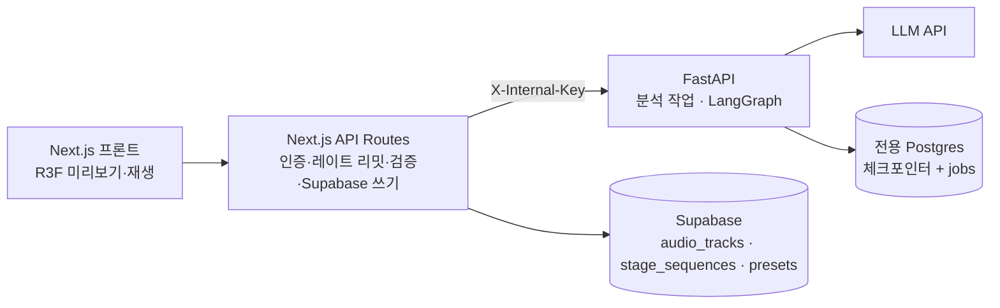

# 무대 연출 디렉터 에이전트 — 설계 스펙

2026-09-19 · 기반 문서: [기획서](../../stage-director-agent-proposal.md)

이 문서는 기획서를 브레인스토밍으로 검토한 결과다. 기획서의 방향(음원 분석 → 구간별 `StageState` 제안 → 사람 확인 2회 → 시퀀스 저장)은 유지하고, 기획서가 열어둔 결정과 기존 on-stage 코드와 어긋난 부분을 확정한다.

- 범위: Python 서비스(LangGraph·분석) 설계, Supabase 신규 테이블 요구사항, Next.js ↔ Python 프로토콜, `contracts/` 추출 요건
- 범위 밖: R3F 재생 싱크 UI, interrupt #1 마커 UI 상세 (프론트 설계는 별도), Time Travel, 셰이더 파라미터 확장
- 이 저장소는 `../on-stage`를 읽기 전용으로만 참고한다. on-stage 수정이 필요한 항목은 §11에 별도 작업으로 분리했다.

## 1. 확정한 결정

| # | 결정 | 선택 | 이유 |
| --- | --- | --- | --- |
| D1 | 승인 전 초안 위치 | 작업 시작 시 `stage_sequences` 행 생성(`status=draft`, `thread_id`=행 id). 초안 내용은 체크포인터에만 있고, 승인 시 `items`를 채움 | 진실 공급원이 하나(초안=체크포인터, 승인본=행). `thread_id` 소유권·"진행 중" 목록·레이트 리밋 카운트가 행 하나로 해결됨 |
| D2 | 체크포인터 DB | 전용 Postgres 분리(로컬 docker compose, 배포 시 소형 관리형 Postgres) | `PostgresSaver`는 DB 직접 연결이 필요해 Supabase에 두면 "Python은 Supabase 자격증명을 갖지 않는다"는 원칙이 깨짐. 체크포인트는 버려도 되는 임시 데이터 |
| D3 | 승인본 보관 | 승인본 누적, 최신 `approved_at`이 현재. 곡당 승인본 5개 상한 | Time Travel 없이도 이전 안 복귀 가능. 공유 데모 계정의 행 증가를 상한으로 제어 |
| D4 | 실행 방식 | 비동기 작업 + 폴링 (`running / waiting_input / done / error`) | Vercel 실행 시간 제한 회피, 업로드 분석 진행 UI와 패턴 공유, 탭을 닫았다 돌아와도 이어서 봄 |
| D5 | 분석 로드 노드 | 그래프 밖으로 이동. 분석은 별도 작업, 그래프는 분석 완료된 곡에서만 시작 | Python은 Supabase를 읽을 수 없어 캐시 조회는 Next.js 몫이라 노드가 할 일이 없어짐 |
| D6 | 시퀀스 항목 저장 | `stage_sequences.items` jsonb 배열 (자식 테이블 없음) | 구간 10개 안팎, 재생 시 통째로 읽음 |
| D7 | 새 음원 테이블 이름 | `audio_tracks` (기획서의 `tracks`는 기존 디스코그래피 테이블과 충돌) | 기존 `tracks`는 오너 전용 쓰기 RLS라 공유 데모 계정이 업로드할 수 없음 |

## 2. on-stage 조사 결과

기획서를 쓸 때 가정과 실제가 다른 곳이다. 근거 파일은 모두 `../on-stage/` 기준.

| 사실 | 근거 | 영향 |
| --- | --- | --- |
| `mergeStageState`는 숫자를 `typeof === "number"`로만 검사한다. **범위 clamp 없음, hex 형식 검증 없음, NaN/Infinity 통과** | `src/lib/stageState.ts` | 기획서 §6의 "최종 방어선은 `mergeStageState`"는 현재 성립하지 않음. §7의 대응 참고 |
| `POST /api/stage-presets`는 `state`를 검증 없이 jsonb로 저장한다 | `src/app/api/stage-presets/route.ts` | 에이전트 출력은 저장 전에 반드시 자체 검증을 거쳐야 함 |
| `tracks` 테이블이 이미 있다(no, title, duration, cover). 쓰기는 오너 전용 | `supabase/migrations/20260813120014_init.sql` | D7 |
| Storage 버킷 `gallery`는 이미지 3종, 10MB만 허용 | 같은 파일 | 음원 버킷 신설 필요 |
| 인증은 쿠키 세션 + RLS (`createServerSupabase`, `auth.getUser()`) | `src/lib/supabase/server`, `src/proxy.ts` | Python은 사용자 신원이 없음 → `thread_id` 소유 검증은 Next.js가 함 |
| `penumbra`는 `SpotState` 타입, 기본값(0.6), `StageScene`의 SpotLight에는 남아 있고 UI 슬라이더만 제거됨 | `StageScene.tsx`, `SpotControls.tsx` | pydantic 모델에 유지(기본 0.6), 에이전트는 값을 바꾸지 않음. 왕복 시 값이 사라지면 안 됨 |
| 프리셋 API는 GET/POST/DELETE만 있고 PATCH 없음. 덮어쓰기는 POST `overwrite: true`(upsert) | `stage-presets/route.ts`, `[id]/route.ts` | 계약 파일에 그대로 반영 |
| 슬라이더 범위는 UI 상수뿐(design-v2 §5.3): intensity 0–1000, angle 0.1–1.0, penumbra 0–1, smoke.density 0–1 | `docs/design-v2.md` | Python 모델의 clamp 기준 |
| 슬라이더 조작은 100ms 스로틀 없이는 `webglcontextlost`가 재현됨 | `hooks.ts`의 `useThrottledChange` | 재생 중 state 커밋은 구간 경계에서만 (기획서 §8 유지) |

## 3. 아키텍처와 경계


```mermaid
flowchart LR
    FE[Next.js 프론트<br/>R3F 미리보기·재생] --> API[Next.js API Routes<br/>인증·레이트 리밋·검증·Supabase 쓰기]
    API -->|X-Internal-Key| PY[FastAPI<br/>분석 작업 · LangGraph]
    PY --> LLM[LLM API]
    PY --> CP[(전용 Postgres<br/>체크포인터 + jobs)]
    API --> SB[(Supabase<br/>audio_tracks · stage_sequences · presets)]
```

| 주체 | 책임 | 하지 않는 것 |
| --- | --- | --- |
| Next.js | 쿠키 세션 인증, RLS, 레이트 리밋, Supabase 읽기·쓰기, 음원 업로드(서명 URL), Python 중계, 최종 저장 전 검증 | LLM 호출, 오디오 분석 |
| Python (FastAPI) | librosa 분석, LangGraph 실행, LLM 호출, 체크포인터·jobs 소유 | Supabase 접근. 필요한 컨텍스트는 전부 요청 본문으로 받는다 |
| 전용 Postgres | LangGraph 체크포인터 테이블, `jobs` 테이블 | Python 외 접근 |

Python이 요청으로 받는 컨텍스트: 분석 JSON, 곡 메타(제목·장르·무드 키워드), 아티스트 컨셉(slug, color, shader 파라미터), 기존 프리셋 목록, 음원 서명 URL. Python은 이것을 그래프 상태에 **스냅샷**으로 저장해 "LLM이 실제로 본 입력"을 재현 가능하게 한다.

## 4. 실행 프로토콜

### 4.1 분석 작업 (그래프 밖)

1. 업로드 후 Next.js가 `audio_tracks` 행 생성(`analysis_status=pending`). `file_hash`가 같은 본인 곡에 분석 결과가 있으면 재사용하고 끝.
2. Next.js → Python `POST /analyze {jobId, audioUrl}` → 202 `{jobId, status, progress, result?, error?}`. `jobId` 는 `audio_tracks.id` 이고 `audioUrl` 은 음원 서명 URL 이다. 멱등: 같은 `jobId` 로 다시 부르면 현재 상태를 돌려주고, `error` 일 때만 처음부터 다시 분석한다. `audioUrl` 이 https·443 포트·허용 호스트(Supabase 프로젝트)·공인 IP 조건을 못 지키면 큐에 넣지 않고 422 `{detail:"invalid_audio_url"}`.
3. 프론트가 `GET /api/audio-tracks/{id}`를 폴링. Next.js가 Python `GET /analyze/{jobId}`를 조회해 `queued / running / done / error`와 `progress`(0~1, 내려받기 전 0.1 · 후 0.4 · 완료 1.0 의 단계 단위)를 전달한다. `queued` 는 분석 풀(동시 1건)이 차서 순서를 기다리는 중이다. 모르는 작업(그래프 작업 id 포함)은 404 `{detail:"job_not_found"}`.
4. `done`이면 `result` 는 `{analysis, fileHash}`(`analysis` 는 §5 `audio_tracks.analysis` 모양, `fileHash` 는 내려받은 바이트의 sha256). Next.js가 `analysis`를 저장(멱등)하고 `analysis_status=done`. 탭을 닫아도 결과는 Python `jobs`에 마지막 갱신 후 7일 보관되어 다음 폴링 때 저장된다. `error` 의 코드: `audio_unavailable`(내려받기 실패·차단) · `decode_failed`(오디오로 읽을 수 없음) · `too_long`(180초 + 1초 초과) · `internal_error` · `interrupted`(처리 중 서버가 재시작됨, 같은 `jobId` 로 `POST /analyze` 를 다시 부르면 처음부터 재시도). 음원 파일 크기는 30MiB 까지 받는다 — 음원 버킷의 크기 상한도 이 값 이하로 맞춘다.
5. 시드 곡은 오프라인 스크립트(`python -m stage_director.analysis.seed`)로 미리 분석해 이 경로를 건너뛴다. 스크립트는 곡마다 `{fileName, fileHash, durationSec, analysis}` JSON 을 내보내고(Python 은 Supabase 에 쓰지 않는다), on-stage 시드 스크립트가 이 값을 `audio_tracks` 의 `file_hash`·`duration_sec`·`analysis` 로 넣는다. 결과의 모양은 업로드 분석과 같은 코드가 만든다. 분석은 이미 `audio_tracks.analysis`에 있으므로 무거운 분석 작업(librosa·구조 모델)은 돌지 않고, 그래프는 Next.js가 채워주는 컨텍스트만으로 시작한다.

### 4.2 시퀀스 생성 작업

| 요청 | 동작 |
| --- | --- |
| `POST /api/sequences {audioTrackId}` | 아래 순서로 검사한다. ① 인증 ② 레이트 리밋 ③ 곡 조회(RLS, 보이지 않으면 404) ④ **곡의 `analysis_status`가 `'done'`이 아니면 409 `{error:"analysis_not_ready"}`로 거절**(`pending`·`running`·`error` 모두 해당. 그래프는 분석 완료된 곡에서만 시작한다는 D5의 진입 조건) ⑤ 곡당 승인본 5개 상한(초과 시 409). 모두 통과하고 이미 `draft`가 있으면 새로 만들지 않고 그 행을 반환하되, **반환하기 전에 Python `GET /runs/{threadId}`로 스레드가 살아 있는지 확인한다.** 스레드가 없으면(§6.4 규칙 2로 삭제됨) 초안 행을 반환하지 않고 `GET /api/sequences/{id}`와 같은 410 정리 경로를 탄다(초안 행 삭제 후 410). 클라이언트가 다시 요청하면 `draft`가 없으므로 새로 만든다. `draft`가 없으면 행 생성 후 Python `POST /runs {threadId, context}` → 202. Python 호출이 실패하면 행을 삭제(보상)하고 502 |
| `GET /api/sequences/{id}` | 행 조회(RLS)로 소유권 확인 후 Python `GET /runs/{threadId}` 결과를 합쳐 `{status, interrupt?, error?}` 반환. Python이 스레드를 모르면(만료) 행을 삭제하고 410 |
| `POST /api/sequences/{id}/resume` | 본문 `{interruptId, kind: "sections"|"feedback"|"approve", payload}`. Python은 `waiting_input`이면서 `interruptId`가 현재 것과 같을 때만 받는다. 아니면 409 (더블 클릭·낡은 화면 방어) |
| 승인 완료 | Python `done` 응답의 최종 시퀀스를 Next.js가 §7 검증 후 `items` 저장, `status=approved`, `approved_at=now()` |

Python 쪽 `/runs` 프로토콜은 4단계(사람 개입)에서 구현했다. 잠정 `POST /sequence` 는 삭제됐다.

| Python 엔드포인트 | 동작 |
| --- | --- |
| `POST /runs {threadId, context}` → 202 | 멱등. 새 스레드면 `jobs` 행을 만들고 백그라운드 스레드에서 그래프를 시작한다. 이미 있으면 현재 상태를 돌려주고, `error` 면 마지막 체크포인트(없으면 처음)에서 재개한다 |
| `GET /runs/{threadId}` → 200 `{status, interrupt?, result?, error?}` | `waiting_input` 이면 현재 interrupt 페이로드, `done` 이면 `jobs.result`(`{sections, items, issues}`)를 돌려준다. 모르는 스레드(존재한 적 없거나 보존 정책으로 삭제)는 404 `thread_not_found` — Next.js 가 410 으로 바꾸고 초안 행을 삭제한다 |
| `POST /runs/{threadId}/resume {interruptId, kind, payload}` → 202 | 409: `not_waiting_input`(더블 클릭 포함) · `stale_interrupt` · `kind_mismatch` / 422: `invalid_sections` · `invalid_targets` / 404 |

`context` 는 기존 곡 전체 요청(`track`, `artist`, `presets`, `analysis`, `durationSec`)에 선택 필드 `audioUrl`(음원 서명 URL, 무드 해석용)을 더한 것이다. `audioUrl` 이 https·443 포트·허용 호스트·공인 IP 조건을 못 지키면 무드 해석을 건너뛴다(요청은 거절하지 않는다. 무드는 비치명적).

`status` 는 `queued / running / waiting_input / done / error` 다. `queued` 는 그래프 풀(동시 2건)이 차서 시작을 기다리는 상태이고, 프론트는 `running` 처럼 보여 주되 "대기 중" 문구를 쓸 수 있다. 처리 중에 서버가 죽거나 재시작되면 새 인스턴스가 켜질 때 그 작업이 `error` / `interrupted` 로 바뀌고, 같은 `threadId` 로 `POST /runs` 를 다시 부르면 마지막 체크포인트에서 이어진다. 분석 작업 id 로 `/runs` 를 부르면 404 `thread_not_found` 다.

**승인된 시퀀스는 Python 을 부르지 않는다.** `done` 이 된 스레드의 `jobs` 행은 7일 뒤 지워지고(§6.4 규칙 3) 체크포인트는 24시간 뒤 지워진다. Next.js 는 `approved` 시퀀스 행을 Supabase 에서만 읽는다. Python 의 404 를 410 으로 바꿔 행을 지우는 경로는 `draft` 행에만 쓴다.

Python 엔드포인트는 모두 `X-Internal-Key` 필수이며 키는 서버 환경변수에만 둔다. `POST /runs`는 같은 `threadId`로 다시 호출되면 멱등하다(이미 있으면 현재 상태 반환, 마지막 체크포인트에서 재개 필요 시에만 재실행).

## 5. 데이터 모델 (Supabase 신규)

DDL은 on-stage 마이그레이션에 들어간다(§11). 이 저장소는 계약 파일에 요구사항으로만 기록한다.

**`audio_tracks`**

| 컬럼 | 비고 |
| --- | --- |
| id uuid pk | |
| user_id uuid null | NULL = 시드 곡. 기본값 `auth.uid()` |
| artist_id uuid fk | |
| title, genre text, mood_keywords text[] | 곡 메타 |
| storage_path text | 음원 버킷 경로 |
| file_hash text | sha256. 분석 캐시 키 |
| duration_sec numeric | 최대 180 |
| analysis jsonb null, analysis_status text | `pending / running / done / error` |
| created_at | |

RLS: 읽기 `user_id is null or user_id = auth.uid()`(시드 공개, `gallery_images`의 시드 패턴과 동일), 쓰기 `user_id = auth.uid()`.

**`stage_sequences`**

| 컬럼 | 비고 |
| --- | --- |
| id uuid pk | = LangGraph `thread_id` |
| user_id uuid, audio_track_id uuid fk | |
| status text | `draft / approved` |
| items jsonb null | 승인 전 null |
| approved_at timestamptz null, created_at | |

- RLS: `stage_presets`와 동일한 완전 사용자 스코프(`user_id = auth.uid()`).
- 부분 유니크 인덱스: `(user_id, audio_track_id) where status = 'draft'`.
- 승인본 5개 상한은 `(user_id, audio_track_id)` 단위이며 Next.js 라우트에서 강제한다. §1 D3, §4.2의 "곡당"도 같은 뜻이다.

**`items` 항목** (기획서 §6 그대로)

```json
{ "sectionLabel": "chorus", "startSec": 42.3, "endSec": 71.8,
  "transitionMs": 2000, "state": { "...": "StageState" }, "rationale": "..." }
```

불변식(검증 게이트와 Next.js 저장 직전에 동일하게 검사):
- 배열 순서 = 시간 순서, `startSec < endSec`
- 첫 항목 `startSec = 0`, 마지막 `endSec = duration_sec`, `items[i].endSec == items[i+1].startSec` (빈틈·겹침 없음 → 재생 시 `currentTime`으로 구간 조회가 단순해짐)
- `0 <= transitionMs <= (endSec - startSec) * 1000`

**음원 Storage 버킷** 신설: audio MIME 허용 목록과 3분 곡 기준 크기 상한. 업로드는 `/api/gallery/upload-url`의 서명 URL 패턴을 복제한다.

## 6. 체크포인터와 그래프 상태

### 6.1 전용 Postgres 스키마

| 테이블 | 소유 | 내용 |
| --- | --- | --- |
| `checkpoints`, `checkpoint_blobs`, `checkpoint_writes`, `checkpoint_migrations` | LangGraph | `setup()`이 생성. 스키마를 직접 설계하지 않는다 |
| **`jobs`** | 이 프로젝트 | `id text pk`(그래프 작업은 `thread_id`, 분석 작업은 `jobId`), `kind`(`graph`/`analysis`, 기본 `graph`), `status`(`queued/running/waiting_input/done/error`), `progress real null`(분석 작업만), `result jsonb null`, `error text null`, `updated_at`. `created_at` 은 쓸 곳이 없어 두지 않는다 |

`jobs`가 필요한 이유: 백그라운드 실행 중 Python 프로세스가 죽으면 체크포인트만으로는 "실행 중이었는지"를 알 수 없다. 서비스가 시작될 때 `queued`·`running` 으로 남은 작업(그래프·분석 모두)은 `error(interrupted)`로 바뀐다. 사용자가 "다시 시도"하면 같은 `thread_id`로 마지막 체크포인트에서 재개한다(분석 작업은 처음부터). 인스턴스 1대를 전제한다: 배포 중 옛 인스턴스가 잠시 살아 있으면 새 인스턴스가 그 작업도 `interrupted` 로 만들지만 옛 인스턴스는 곧 내려가므로 영향이 없고, 줄 서 있던(`queued`) 작업은 스레드가 깨어나도 `queued → running` 전이가 실패해 실행되지 않는다. 인스턴스가 여러 대가 되면 heartbeat(맡은 프로세스가 주기적으로 갱신하고 끊기면 죽은 것으로 판정)나 별도 워커가 필요하다. `waiting_input` 은 스레드가 필요 없어 영향이 없다.

스키마 변경은 `CREATE TABLE IF NOT EXISTS` 로 4단계 모양을 만든 뒤 컬럼마다 `ALTER TABLE jobs ADD COLUMN IF NOT EXISTS` 를 이어 실행하는 방식이다(서비스 시작 시, advisory lock 으로 인스턴스 동시 기동을 직렬화). 새 DB 도 4단계까지 쓰던 DB 도 같은 경로를 타고 기존 행은 그대로 남는다. 컬럼을 더할 때는 `jobs.py` 의 `_DDL` 끝에 한 줄을 추가한다.

상태 판정(그래프 작업): `jobs.status` 는 Runner 가 전이 시점(시작 `running`, interrupt 도달 `waiting_input`, 종료 `done`, 예외 `error`)에 조건부 UPDATE 로 직접 기록한다. 대기 중인 interrupt 페이로드는 체크포인트의 `tasks[].interrupts` 에서 읽는다. 분석 작업은 같은 표에서 `kind=analysis` 로 구별하며 `queued → running → done / error` 로 흐른다. 그래프 작업의 `progress` 는 비어 있다.

### 6.2 `thread_id`

`thread_id = stage_sequences.id`(uuid 문자열). Python은 이 값의 소유자를 검증하지 않는다. 모든 Python 호출은 Next.js가 RLS로 소유권을 확인한 뒤에만 나가며, 내부 API 키는 서버 사이드에만 존재한다.

### 6.3 그래프 상태

체크포인트가 커지지 않도록 곡선은 다운샘플해 스냅샷한다(전체 20KB 미만 목표).

| 필드 | 내용 | 리듀서 |
| --- | --- | --- |
| `context` | 곡 메타, 아티스트 컨셉, 기존 프리셋, 분석 스냅샷(BPM, 비트 위치, 에너지 곡선 ≤1점/초, 온셋 밀도, 구간 후보) | 시작 시 1회 설정 후 불변 |
| `sections` | `[{idx, label, startSec, endSec, mood}]`. 무드 해석 → interrupt #1에서 사용자 수정 반영 | 교체 |
| `proposals` | `{idx: SequenceItem}` | idx 단위 병합 리듀서(Send 병렬 합치기 + 부분 재생성) |
| `feedback_log` | `[{turn, text, targets: [idx]}]` | 추가 |
| `issues` | 검증 게이트가 낸 경고 | 교체 |
| `revision` | 정수. interrupt id 생성에 쓰임 | 증가 |
| `final` | 확정된 `items` | 1회 설정 |

- 구간 경계는 interrupt #1에서만 바뀐다. 이후 피드백은 기존 구간의 `state`·`rationale`만 재생성하므로 `idx`가 안정적이다.
- `interruptId = f"{thread_id}:{revision}:{kind}"`. 낡은 화면에서 온 resume은 거부된다.
- 부분 재생성 불변식: 사용자가 지정한 `targets` 밖의 `proposals[idx]`는 바이트 단위로 같아야 한다(테스트 대상).
- Interrupt 페이로드: #1 `{interruptId, kind:"confirm_sections", sections:[{label,startSec,endSec,mood}], energyCurve, durationSec}`, #2 `{interruptId, kind:"review", items, issues}`. Resume 페이로드(`POST …/resume` 본문 `{interruptId, kind, payload}`): #1 `kind:"sections"`, `payload:{sections}`(연속 덮음·최소 길이·개수·라벨 검증 후 수용, 위반 시 422), #2 `kind:"approve"`(payload 없음) 또는 `kind:"feedback"`, `payload:{text, targets:[idx]}`. **`targets` 는 사용자가 지정한다**(LLM 라우터 없음). 피드백 턴의 자동 재생성도 `targets` 안으로 제한되고, 피드백 턴마다 자동 재생성 예산(2회)이 다시 주어진다.

### 6.4 보존 정책

아래 두 규칙은 **대상과 기준 시각, 지우는 범위가 서로 다르다.** 둘 다 서비스 시작 시와 주기 스크립트에서 실행한다.

**규칙 1. 승인된 스레드: 승인 24시간 후 체크포인트만 삭제**

- 대상: 승인이 끝난 그래프 작업(`jobs.status=done`. 이 규칙은 그래프 작업(`kind=graph`)에만 적용된다).
- 기준 시각: `jobs.status`가 `done`이 된 시각(= 사용자가 승인해 최종 시퀀스가 나온 시점). Python은 Supabase의 `approved_at`을 볼 수 없으므로 이 시각을 쓴다.
- 삭제 범위: LangGraph 체크포인트(실행 기록)만 `adelete_thread`로 지운다. 승인본은 이미 `stage_sequences.items`에 있고 이후 조회는 그 행을 읽으므로 체크포인트는 필요 없다.
- 24시간을 두는 이유: 승인 직후 Next.js가 최종 시퀀스를 저장하다 실패해도 같은 스레드에서 결과를 다시 받아 저장할 수 있게 하는 여유 시간이다.

**규칙 2. 승인되지 않은 초안(draft): 7일 방치되면 통째로 삭제**

- 대상: 승인되지 않은 그래프 작업(`jobs.status`가 `queued / running / waiting_input / error`).
- 기준 시각: `jobs.updated_at`(마지막 활동). 재개나 피드백이 있으면 갱신되므로 7일간 아무 활동이 없을 때만 해당한다.
- 삭제 범위: Python 쪽은 체크포인트와 `jobs` 행을 모두 지운다. Supabase의 `draft` 행은 Python이 지우지 못하므로(Supabase에 쓰지 않는다), 다음 조회 때 Next.js가 지운다. 스레드가 삭제된 초안을 조회하면 Python이 스레드를 모른다고 답하고, Next.js가 410을 돌려주며 초안 행을 삭제한다. UI는 "세션이 만료되었습니다. 다시 시작하세요"를 표시한다.

**규칙 3. 승인된 스레드의 `jobs` 행: `done` 7일 후 삭제**

- 대상: `jobs.status=done` 인 그래프 작업. 기준 시각은 `jobs.updated_at`(= `done` 이 된 시각).
- 삭제 범위: `jobs` 행. 체크포인트는 규칙 1 로 이미 24시간에 지워졌다. 이 규칙이 없으면 완료된 작업의 행이 영원히 쌓이고 규칙 1 이 매번 같은 스레드를 다시 훑는다.
- 이후 이 `threadId` 를 조회하면 404 다. 승인본은 Supabase 에 있으므로 Next.js 는 `approved` 행에 대해 Python 을 부르지 않는다(§4.2).

**규칙 4. 분석 작업: 7일 후 삭제**

- 대상: `kind=analysis` 인 모든 행(`queued / running / done / error`). 기준 시각은 `jobs.updated_at`.
- 삭제 범위: `jobs` 행만(체크포인트가 없다). 탭을 닫아도 다음 폴링 때 결과가 저장되게 하기 위한 보관 기간이며(§4.1), 7일 넘게 `queued`·`running` 인 행은 죽은 작업이다.

**실행 시점.** 네 규칙 모두 서비스 시작 시, 실행 중 6시간마다(`RETENTION_INTERVAL_SEC`), 주기 스크립트 `python -m stage_director.retention` 에서 돈다. 유휴 시 0대로 줄었다 켜지는 호스팅에서는 인스턴스가 켜질 때의 시작 시 실행이 사실상 정기 실행이다.

## 7. 검증

세 겹으로 방어한다. 각 층의 책임이 다르다.

| 층 | 위치 | 규칙 |
| --- | --- | --- |
| 1. 모델 | Python pydantic | `color`·`smoke.color`: `^#[0-9a-fA-F]{6}$`. `intensity` 0–1000, `angle` 0.1–1.0, `penumbra` 0–1, `smoke.density` 0–1: **범위 밖은 clamp하고 issue를 기록**(거부하지 않음). `camera` enum 밖은 기본값. 필드 단위 폴백은 `mergeStageState`와 같은 의미 |
| 2. 게이트 | LangGraph 검증 노드 | §5 불변식, 시그니처 컬러에서 벗어나면 `rationale`에 이유 필수, 규칙 체크(에너지와 밝기가 같은 방향, 잔잔한 구간 `intensity` ≤ 500). 위반 구간은 최대 2회 자동 재생성 후에도 남으면 경고로 interrupt #2에 노출 |
| 3. 저장 | Next.js | §5 불변식 + `mergeStageState`. **`mergeStageState`에 clamp가 없으므로(§2) 범위 방어는 1층이 유일한 실효 방어선**이다. on-stage에 clamp 추가 작업(§11)이 반영되면 3층도 실효를 갖는다 |

이미 저장된 프리셋에 범위 밖 값이 있을 수 있으므로, 컨텍스트로 받은 기존 프리셋도 모델을 통과시켜 clamp한 뒤 사용한다.

## 8. 오류 처리

| 상황 | 동작 |
| --- | --- |
| LLM 호출 실패 | 호출마다 주 모델 실패 시 예비 모델(`GEMINI_FALLBACK_MODEL`)로 1회 더 시도하고, 노드 단위 재시도 2회(무드 해석도 2회) → 실패 시 `jobs.status=error`와 메시지. 사용자가 "다시 시도"하면 마지막 체크포인트에서 재개 |
| `/propose` 동기 호출 | 최악 약 6분(주 모델 60초 + 예비 모델 60초, 노드 재시도 3회)이라 프록시·서버리스 시간 제한에 걸린다. 배포 환경에서 Next.js 는 호출하지 않고 시퀀스 생성은 `/runs` 를 쓴다 |
| 구조 출력이 스키마 불일치 | 1층에서 폴백·clamp, 필드 하나가 깨져도 나머지 유지(필드별 방어) |
| Python 서비스 다운 | Next.js가 502. 시드 곡의 캐시된 예시 시퀀스로 폴백(기획서 §11, Next.js 측 구현) |
| 분석 실패 | `analysis_status=error`, 사용자에게 재시도 또는 에너지 곡선 기반 경계 제안 모드 안내(1단계 스파이크 결과에 따라 확정) |
| Python 프로세스가 작업 도중 죽음(배포·재시작 포함) | 새 인스턴스가 켜질 때 `queued`·`running` 작업이 `error(interrupted)`. 다시 시도하면 그래프는 마지막 체크포인트에서, 분석은 처음부터 이어진다(§6.1) |
| Gemini 분당 한도 | Python 이 모델마다 슬라이딩 윈도우(`GEMINI_RPM`, 기본 10)로 요청 간격을 조절한다. 대기하는 동안 작업은 `running` 으로 보인다. 429 가 그래도 나면 위 "LLM 호출 실패" 행의 예비 모델·재시도를 탄다 |
| 음원 URL 이 허용되지 않음(`/analyze`) | 422 `invalid_audio_url`. 그래프의 `audioUrl` 은 무드 해석만 건너뛴다 |
| 낡은 resume, 더블 클릭 | 409 |
| 스레드 만료 | 410, 초안 행 정리 |
| 한도 초과 | Next.js 레이트 리밋(계정·IP, 일일 한도) |

## 9. 테스트 전략

| 대상 | 방법 |
| --- | --- |
| pydantic 모델, `merge_stage_state` 포트, clamp, 불변식 검사, 리듀서(부분 재생성 불변식), jobs 상태 판정 | **TDD, 처음부터.** `merge_stage_state`는 계약의 골든 케이스 JSON(§10)으로 검증해 TS 동작과 일치를 보증 |
| librosa 분석 | 합성 오디오(클릭 트랙·사인파)를 코드로 생성해 BPM·에너지 곡선을 검증. 실제 Lyria 곡은 1단계 스파이크에서 육안 검토(자동 테스트 아님) |
| LLM 노드 | 결정적 가짜 LLM 주입 + 소규모 평가 세트의 규칙 체크(§7 2층). 실제 모델 호출 테스트는 별도 마커로 분리 |
| interrupt/재개 | `InMemorySaver`로 그래프 흐름 테스트 + 전용 Postgres(docker)에서 프로세스 재시작 후 재개하는 통합 테스트 1건 |
| 프로토콜 | FastAPI TestClient로 409/410/멱등성 |

LLM provider는 클라이언트를 주입하는 인터페이스 뒤에 둔다. Gemini를 쓰며, 텍스트 입력 구조화 출력은 싱글 제안 계획에서 확정했고 오디오 입력 무드 해석은 4단계(사람 개입)로 미뤘다(§13).

## 10. `contracts/` 요건 (plan의 첫 태스크)

목적: on-stage에서 **실제로 필요한 계약만** 이 저장소로 옮겨, 이후 구현이 `../on-stage`를 열지 않고 `contracts/`만 보고 진행되게 한다.

| 파일 | 내용 | 출처 |
| --- | --- | --- |
| `contracts/README.md` | 각 파일의 출처(on-stage 파일 경로), 추출 시점의 on-stage 커밋 해시, "계약에 없으면 추측하지 말고 계약 갱신 태스크를 만든다" 규칙 | 신규 |
| `contracts/stage_state.py` | `SpotState`, `StageState`, camera enum, `default_stage_state(color)`, `merge_stage_state`(TS 필드별 폴백 포트) + 범위 clamp·hex 검증(§7 1층, 이 부분은 계약이 아니라 우리 규칙임을 주석으로 구분) | `src/lib/stageState.ts`, design-v2 §5.1·§5.3 |
| `contracts/fixtures/merge_stage_state_cases.json` | `stageState.test.ts`의 케이스를 `{name, input, fallback, expected}`로 옮긴 골든 벡터(null, 배열, 1차 저장값, smoke 누락, 스팟 부분 누락, camera enum 밖 등) | `src/lib/stageState.test.ts` |
| `contracts/api_stage_presets.md` | GET/POST/DELETE 요청·응답·상태 코드 표기(§2 사실의 코드/본문 포함): GET `?artist=<slug>` → 200 `{presets:[{id,name,state}]}`(name 오름차순), 400 `{error:"bad request"}`, 404 `{error:"artist not found"}`, 500 `{error:<message>}` / POST `{artistSlug,name,state,overwrite?}` → 201 `{id}`, 401, 400, 404, 409 `{error:"duplicate"}`, 500 / DELETE → 204, 401, 403 `{error:"forbidden"}`, 500 | `stage-presets/route.ts`, `[id]/route.ts`, `routeHelpers.ts` |
| `contracts/enums_and_constants.md` | camera 값 3종, 스팟 키 3종, 셰이더 패턴(`wave`/`ripple`/`grain`), 아티스트 slug·시그니처 컬러(aurora `#9F77DD`, velvet `#7F77DD`, nova `#D4537E`, halo `#BA7517`, lumen `#1D9E75`, echo `#378ADD`), 슬라이더 범위·step·기본값, `defaultStageState` 기본 상태 | `stageState.ts`, `types.ts`, `src/data/artists.json`, design-v2 §5.3 |
| `contracts/artist_context.md` | Python이 컨텍스트로 받는 아티스트 모양(slug, name, nameKo, color, shader{pattern, freq, falloff, speed}) — `Artist` 타입의 부분집합과 `GET /api/artists?slug=` 응답 | `types.ts`, `api/artists/route.ts` |
| `contracts/supabase_required.md` | **기존 사실**: `stage_presets` 컬럼·유니크 키·RLS 의미, 인증 모델(쿠키 세션+RLS), 서명 URL 업로드 패턴. **신규 요구사항**(on-stage가 구현할 것): §5의 `audio_tracks`, `stage_sequences`, 음원 버킷. 두 부분을 문서 안에서 명확히 구분 | `init.sql`, `gallery/upload-url/route.ts`, 이 스펙 §5 |

## 11. 기획서 변경과 on-stage 쪽 후속 작업

이 저장소 밖에서(또는 별도 승인으로) 처리할 항목이며, 이 스펙의 구현 태스크에 포함하지 않는다.

| 항목 | 내용 |
| --- | --- |
| on-stage: `mergeStageState` clamp + hex 검증 | TDD로 추가. §7 3층이 실효를 갖는 조건 |
| on-stage: 마이그레이션 | `audio_tracks`, `stage_sequences`, 음원 버킷, RLS(§5) |
| on-stage: API 라우트 | `/api/sequences*`, `/api/audio-tracks*`, Python 중계, 레이트 리밋 |
| on-stage: README | "백엔드 서버 분리 없음" 항목을 분리 근거와 함께 갱신(기획서 §9) |
| 기획서 갱신 | 노드 A 제거(D5), `tracks` → `audio_tracks`(D7), "`mergeStageState`가 clamp한다" 가정 삭제(§2), 체크포인터 DB 분리(D2)와 `jobs`, 폴링 프로토콜(D4) 반영 |
| 음원 약관 확인 | 기획서 §4의 체크박스 그대로 유지 |

## 12. 구현 계획(writing-plans)에 대한 제약

1. **첫 태스크는 `contracts/` 생성(§10)이다.** 완료 기준: 각 파일이 존재하고, `stage_state.py`가 골든 벡터를 전부 통과하는 테스트가 있고, `contracts/README.md`에 출처와 on-stage 커밋 해시가 적혀 있다.
2. **이후 태스크는 `../on-stage`를 열지 않는다.** 계약에 없는 정보가 필요해지면 구현을 멈추고 "계약 갱신" 태스크를 별도로 만든다(그 태스크만 on-stage를 읽는다).
3. 권장: 첫 태스크 완료 후 `.claude/settings.json`의 `additionalDirectories`를 제거하거나 `Read(../on-stage/**)`를 deny에 추가해 규칙을 도구로 강제한다.
4. 태스크 순서는 기획서 §10의 MVP 5단계를 따른다. 단계별 이 스펙의 반영 위치: 1단계 분석 스파이크(§4.1·§9의 분석 테스트), 2단계 싱글 제안(§7 1층, 계약의 프리셋 API), 3단계 시퀀스(§5 불변식·`items`), 4단계 사람 개입(§6 전부), 5단계 배포(§4.1 업로드 분석·§6.4 보존).
5. 결정적 로직(모델·merge·불변식·리듀서·상태 판정)은 TDD로 처음부터 작성한다. 시각 레이어(R3F)는 이 저장소 범위 밖이다.

## 13. 기본값으로 둔 미결정 사항

| 항목 | 기본값 | 확정 시점 |
| --- | --- | --- |
| LLM provider | Gemini, 클라이언트 주입 구조. 텍스트 입력 구조화 출력은 싱글 제안 계획에서 확정(기본 모델 `gemini-3.8-flash`, 환경변수 `GEMINI_MODEL` 로 교체). 오디오 입력 무드 해석은 4단계에서 확정: 곡 전체 오디오 + 구간 시각 목록을 Gemini 에 1회 호출해 구간별 분위기를 받는다(`mood.py`). 실패는 비치명적(`mood=""`)이고, 결과는 interrupt #1 화면에서 사람이 고칠 수 있으며 `Section.mood` 로 propose 프롬프트에 들어간다 | 텍스트·오디오: 확정 |
| 구조 분석 모델 | **에너지 곡선 기반 휴리스틱으로 확정, all-in-one 류는 도입하지 않는다.** 실제 곡 2개(`나만의_작은_우주`, `burn it up`)를 사람이 직접 청취해 검증: 브릿지 전후처럼 뚜렷한 전환(실측 에너지 변화 35~54%)은 정확히 잡지만, 벌스↔코러스처럼 미세한 전환(실측 3~20%, 임계값 35% 미달)은 놓친다 — 최근 믹싱의 라우드니스 압축 때문에 벌스·코러스 음량 차가 작아 에너지만으로는 원천적으로 구분이 어려움. 구간 개수·순서 등 큰 구조는 두 곡 다 맞았다. 임계값을 낮추면 일부(놓친 것 중 턱걸이 수준)는 잡히지만 노이즈성 과다 분할과 곡 2개로 튜닝하는 과적합 위험이 있어, **한계를 알고 받아들이기로 결정**했다 — 세부 보정은 4단계 interrupt #1(사람이 구간을 보고 직접 수정)에서 흡수한다 | 확정 (시퀀스 그래프 계획 Task 6, 2026-10-02 실제 곡 청취 검증) |
| 승인본 상한 5개, 승인 후 체크포인트 삭제 24시간, 초안 방치 삭제 7일 | §5·§6.4 값 | 4단계 전 조정 가능 |
| 호스팅 | Google Cloud Run(asia-southeast1, Neon 과 같은 지역), 1vCPU·메모리 2GiB, `--no-cpu-throttling`(CPU 항상 할당 — 요청 밖에서도 도는 백그라운드 스레드에 필수), `--max-instances 1`(RPM 제한·resume 락이 프로세스 단위, 요금 폭주 방지), `--min-instances 0`(유휴 시 자동 중지로 비용 최소화), 시크릿은 Secret Manager, 상태 확인은 `/health`, 전용 Postgres 는 Neon. **기획서 §9 의 "콜드 스타트 없는 플랜 우선" 을 비용 때문에 의도적으로 접었다** — 평소에는 첫 요청이 콜드 스타트를 겪고, 발표·면접 당일에만 `--min-instances 1` 로 올린다. 배포 절차·환경변수·비용은 `docs/deploy.md` | 확정 (5단계 계획) |
| Gemini RPM 기본값 | 모델당 분당 10회(`GEMINI_RPM`). 실제 계정 한도에 맞춰 조정 | 5단계 사람 단계에서 확인 |
| 분석 입력 상한 | 파일 30MiB, 길이 180초(+1초), 분석 동시 1건 | 5단계 |
